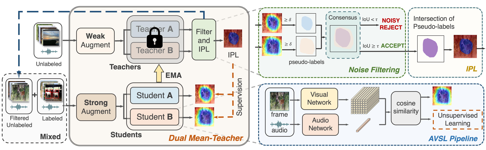
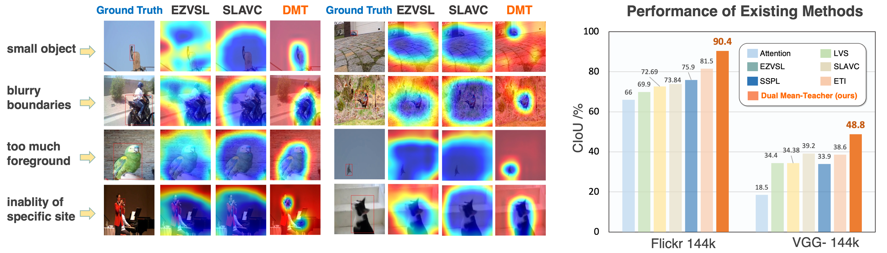

# Dual Mean-Teacher: An Unbiased Semi-Supervised Framework for Audio-Visual Source Localization

Official Implementation of DMT: Dual Mean-Teacher in PyTorch. 

Accepted by NeurIPS2023.

We will release our code soon!

  

  

